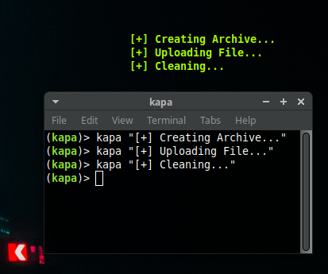

<p align="center">A simple conky text widget<br><br>


</p>


# Installation
```bash
git clone https://github.com/s0ubhik/kapa.git
cd kapa
./install
```

# Usage
#### Start kapa
```bash
kapa -s
```
#### Add text to widget
```bash
kapa Hello Jack
```
#### Clear text
```bash
kapa -c
```
# Preview


